# Keycloak Connector
The Keycloak Connector extends the functionality of the existing Keycloak integration in Axon Ivy.

It enables use cases such as the approval of users who are initially created in Axon Ivy and then stored in Keycloak. The initial user registration takes place in Axon Ivy, and corresponding user accounts are automatically created in Keycloak.

The product also supports interaction with Keycloak for use cases such as role assignments and session management.

Additionally, the Keycloak login theme can be customized and modified to ensure a consistent and branded user experience.

## Demo

### Register user and assign user to group on the KeyCloak
1. User Registration:

Applicants start process `Processes/UserRegistration/register.ivp` first.

Applicants complete the required fields and submit their application for reviewing.

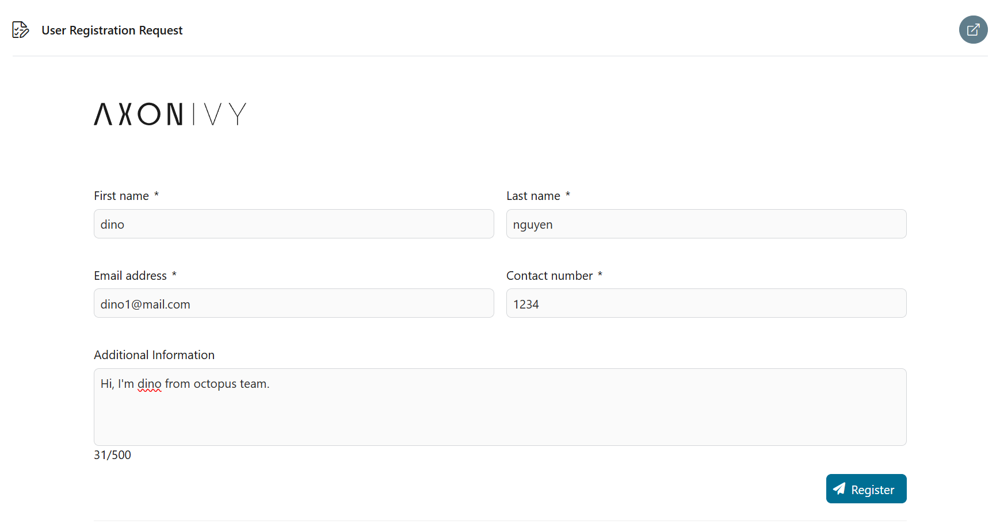

2. Task Creation for Administrative Review: After applicant submission, a review task is automatically generated and assigned to users with the Admin Keycloak role for further evaluation.
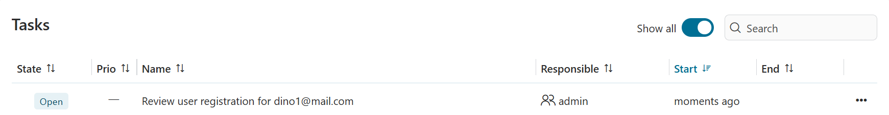

3. Administrative Approval Process: An administrator reviews application details and decides whether to approve or reject the request. If approved, the admin can select `user role` to assign this user to group in Keycloak.

If there is no option for `user role`, read the note in the note below.


> [!Note]
> List of user roles will be loaded from the Keycloak realm. You need to define groups in your Keycloak realm first.
> 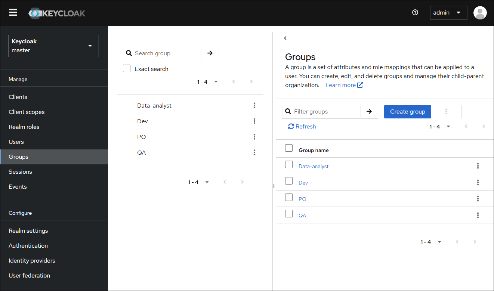

4. User Account Provisioning: For approved applications, a new user account is created in Keycloak. A confirmation email is sent to the user, including a temporary password and instructions for their first login.
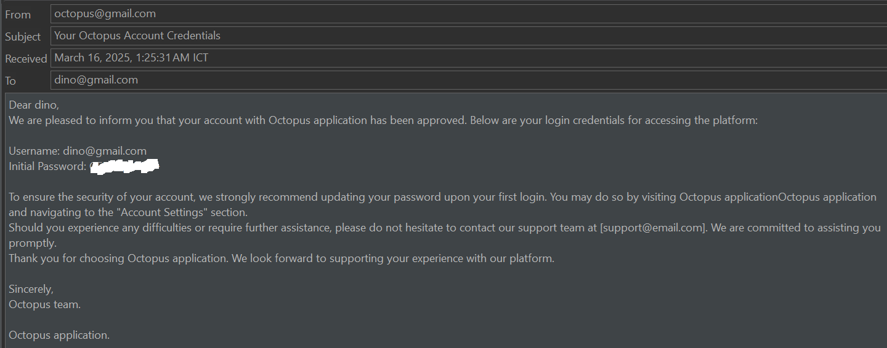

### User management
Administrators can start process `Processes/UserRegistration/mangement.ivp` to:
- View the list of registered users, access detailed user information
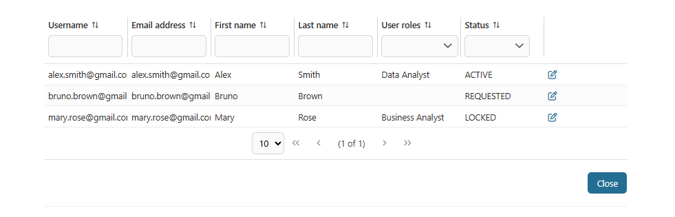
- Perform key actions such as reset, lock or delete user
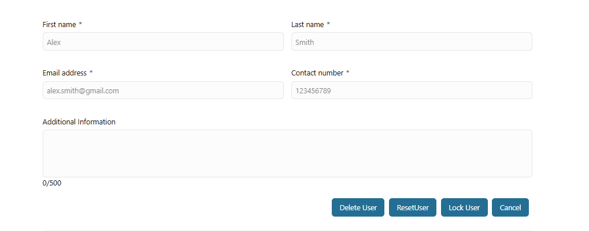

For advanced or full user management, administrators can use the **Keycloak Admin Console**.
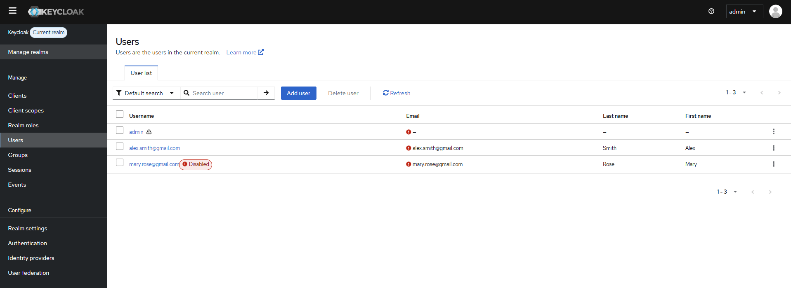


> [!IMPORTANT]
> In a server environment, users can choose option "Log in with Keycloak". 
> After choosing to register, they will be redirected from the login page to a secure external registration form.

## Setup

### Setup Keycloak instance
If you don't have access to an existing Keycloak instance, you can quickly spin up a new one using Docker.
You can use sample `docker-compose.yaml` file below:

```
@docker-compose.yaml@
```

> [!NOTE]
> This sample yaml file is placed at the folder `docker` in the KeyCloak Connector Demo IAR file.
>
> You can download this IAR file at [Keycloak Connector](https://market.axonivy.com/keycloak-connector).
>
> After this IAR file is downloaded, please extract and use the JAR file in folder `docker`.

This setup is intended for demonstration and testing purposes.

You can change `KC_BOOTSTRAP_ADMIN_USERNAME`, `KC_BOOTSTRAP_ADMIN_PASSWORD`, `KC_HOSTNAME` in the `environment` part if you want.

Then, launch the container with the command `docker-compose up -d`.

After the container is started, you can access to **Keycloak Admin Console** by `KC_HOSTNAME`, and use `KC_BOOTSTRAP_ADMIN_USERNAME` and `KC_BOOTSTRAP_ADMIN_PASSWORD` for admin logging in.

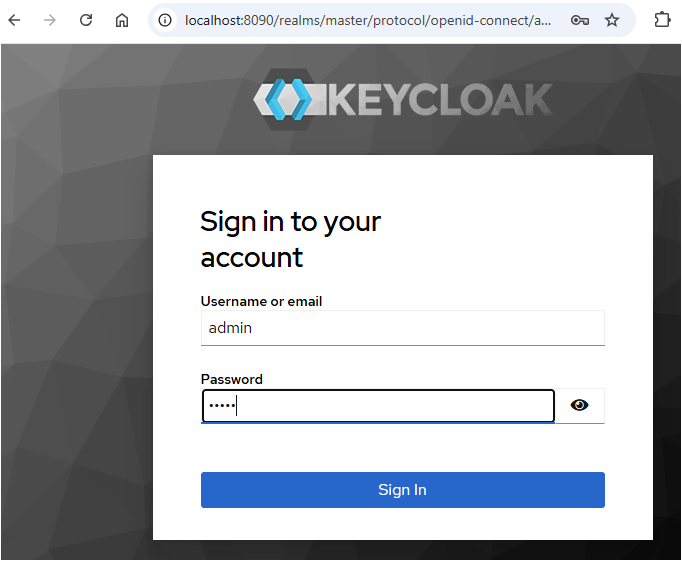

After logged successfully, you can see **Keycloak Admin Console**
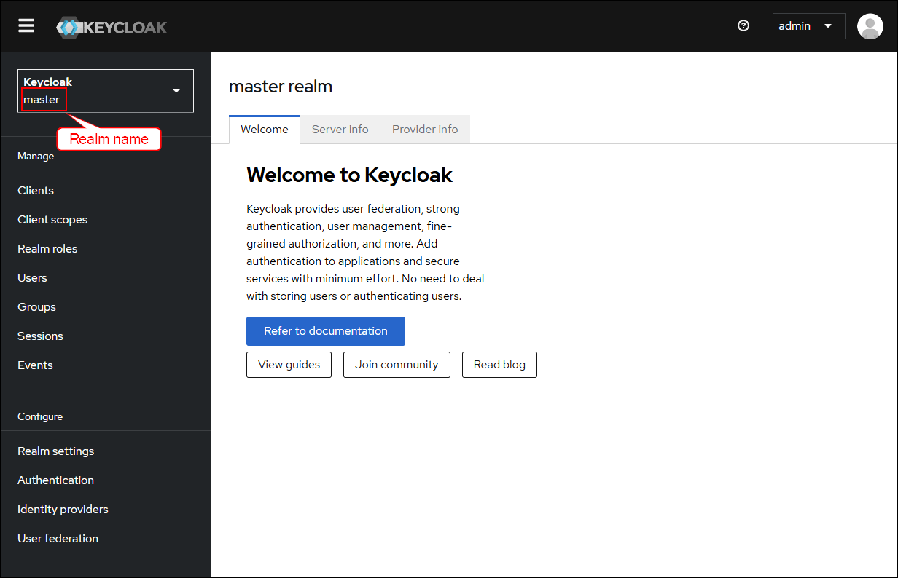

You can define groups in your Keycloak realm.


Additionally, you must also change the values ​​in variables.yaml corresponding to the Keycloak instance.

```
@variables.yaml@
```

### Advanced Setup Keycloak instance
If you want to override the default "Register" link on the login form, you need to follow below steps
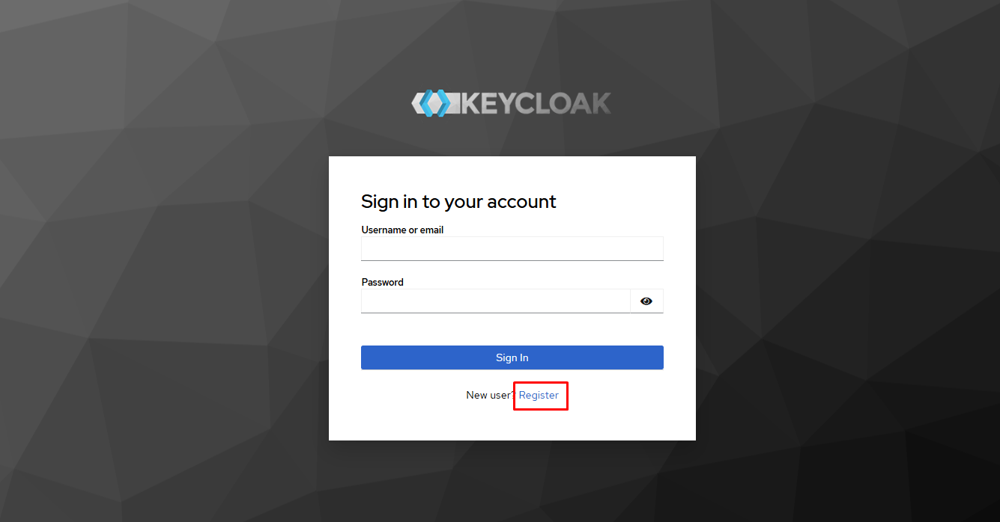

> [!NOTE]
> To display the Register link on the login page, make sure **User Registration** is enabled in your Keycloak realm settings.
> 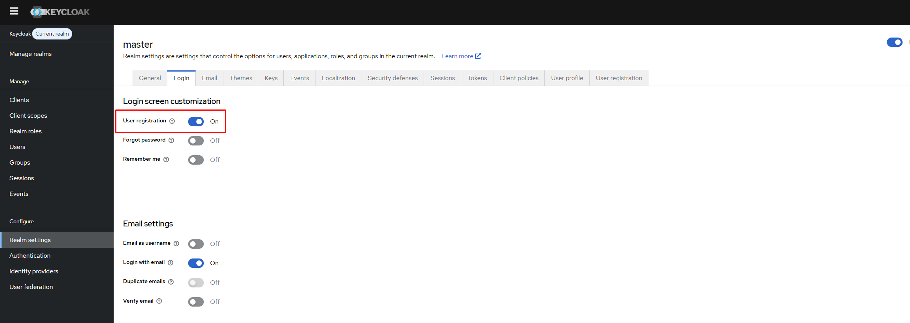

You can personalize the Keycloak registration page, particularly the registration link, by modifying an existing theme `keycloak.v2`. This custom form collects necessary information to better support administrative approval and custom workflows. Follow the steps below:

1. Start `Configuration Management` process with role of Keycloak admin.

2. Upload the Theme JAR: Upload a Keycloak theme JAR file to load the available themes and their configurations. 

A sample Keycloak JAR file is placed at the folder `themes` in the KeyCloak Connector Demo IAR file. You can download this IAR file at [Keycloak Connector](https://market.axonivy.com/keycloak-connector). After this IAR file is downloaded, please extract and use the JAR file in folder `themes`.

If you don't want to use this JAR, you can follow these steps to get another JAR file.

The theme JAR file is typically located in the Keycloak container at *opt/keycloak/lib/lib/main* with a file name starting like *org.keycloak.keycloak-themes<version>.jar*.

You can copy it from the docker container to your local machine using: 

`docker cp <container_id>:/opt/keycloak/lib/lib/main/org.keycloak.keycloak-themes<version>.jar <path_on_local_machine>`

E.g. `docker cp <container_id>:/opt/keycloak/lib/lib/main/org.keycloak.keycloak-themes-26.1.5.jar <path_on_local_machine>`

> [!NOTE]
> To get `container_id`, you can run the command `docker ps -a --filter ancestor=<docker_image>` to find it.
>
> E.g. `image docker ps -a --filter ancestor=quay.io/keycloak/keycloak:26.1`
> 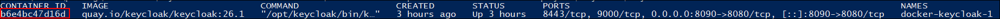

3. Select the Target Theme: Choose the theme you want to customize from the loaded list. This will serve as the base or reference for your new theme. The available themes shown are extracted from the uploaded JAR file.

4. Update the Registration URL: Enter the desired registration URL to which users should be redirected when they click the "Register" link on the login page. This override allows you to integrate with a custom registration system or external page.
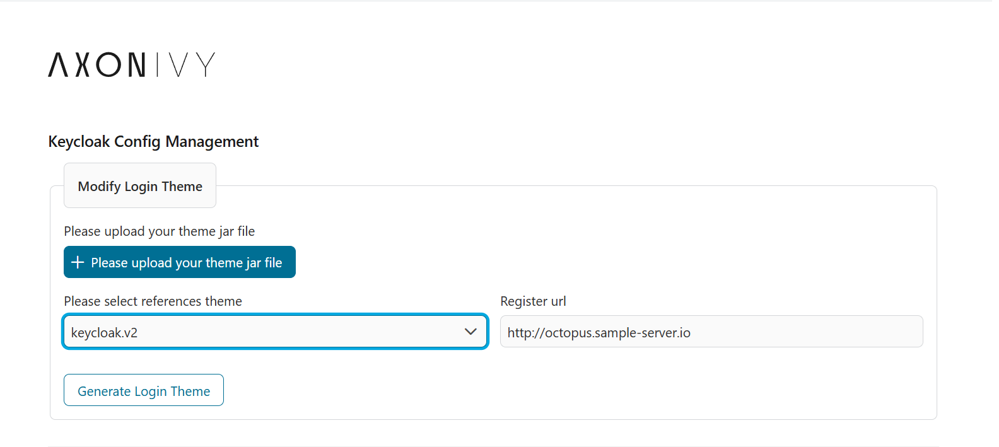

5. Generate the Custom Theme: Click the `Generate Login Theme` button to create a new theme based on your selected reference theme, a zip file will be downloaded.

6. Apply customized theme for login page: Extract the `custom-theme` folder you downloaded, and copy it into the Keycloak container's theme directory at *opt/keycloak/themes*.

You can run the command `docker cp <path_on_local_machine>/custom-theme <container_id>:/opt/keycloak/themes`

Then, configure your realm to select `custom-theme` to apply for the login page.
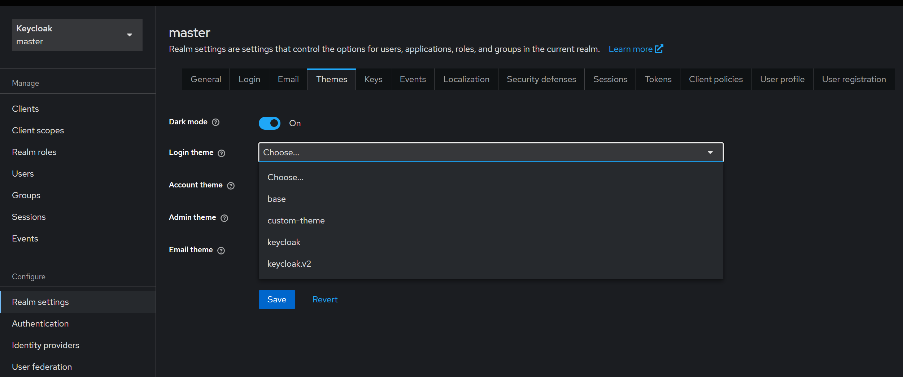

Back to login page and check the register link

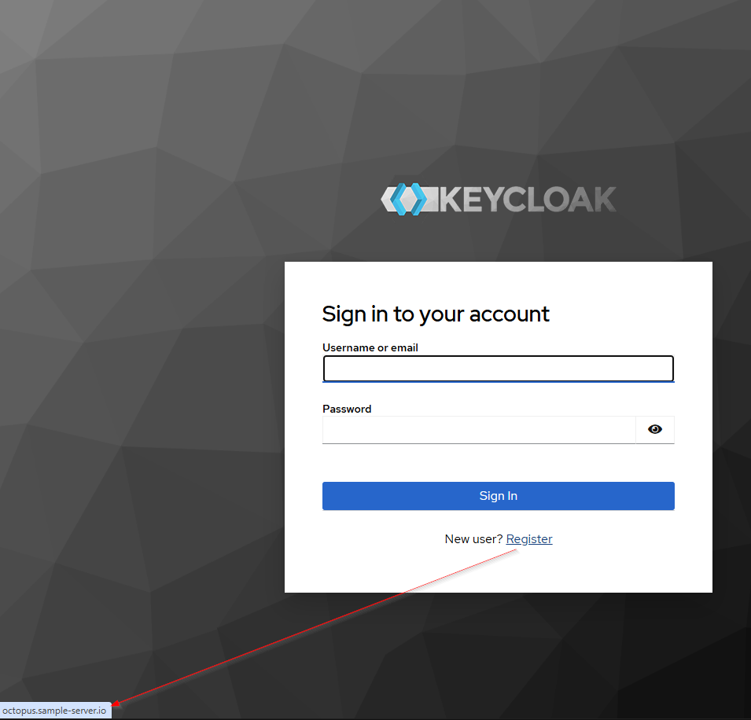
