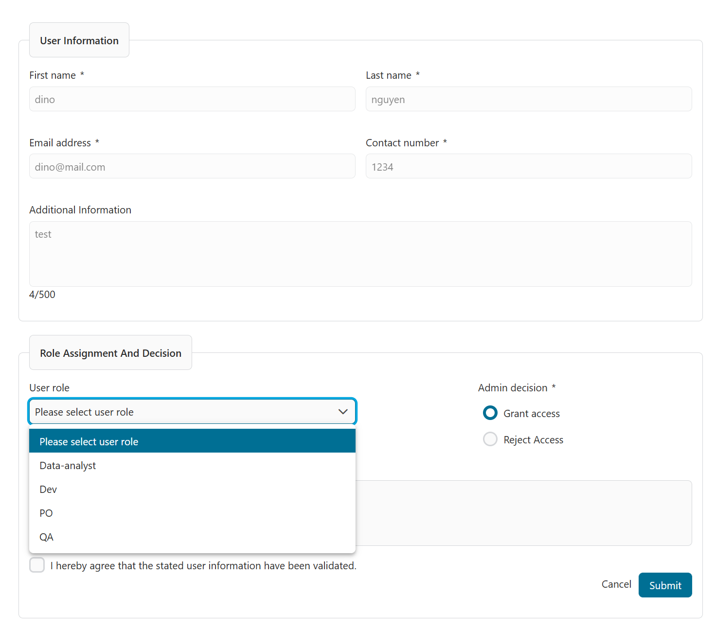

# Keycloak Connector
The Keycloak Connector extends the functionality of the existing Keycloak integration in Axon Ivy.

It enables use cases such as the approval of users who are initially created in Axon Ivy and then stored in Keycloak. The initial user registration takes place in Axon Ivy, and corresponding user accounts are automatically created in Keycloak.

The product also supports interaction with Keycloak for use cases such as role assignments and session management.

Additionally, the Keycloak login theme can be customized and modified to ensure a consistent and branded user experience.

## Demo

#### Use Case: Register new user account
1. User Registration Initiation: From the Keycloak login page, users select the registration option, which directs them to a secure registration form.

2. Submission of Application: Applicants complete the required fields and submit their registration data for processing.


3. Task Creation for Administrative Review: a task is automatically generated and assigned to the "Admin Keycloak" role for further evaluation of the application.


4. Administrative Approval Process: Administrators review each application, making decisions to approve or reject the access request and assigning the appropriate roles to the new user as needed.



5. User Account Provisioning: For approved applications, a new user account is created in Keycloak. A confirmation email is sent to the user, including a temporary password and initial login instructions.


## Setup

### Modify registration link in keycloak login form 
1. Start `Configuration Management` process with role of Keycloak admin.

2. Upload the Theme JAR: Upload the Keycloak theme JAR file to the system to access the existing default theme configurations.

3. Select the Target Theme: Choose the specific theme you wish to customize, focusing on the login form registration link.

4. Update the Registration URL: Enter the desired URL to which users should be redirected when selecting the registration option.


5. Generate the Custom Theme: Click the `Generate Login Theme` button to create a customized version from target theme with custom navigation to provided registration url.

6. Apply customized theme for login page: Extract & copy `custom-theme` folder that we downloaded to `themes` folder of keycloak & apply it for realm login page.


- If you don't have access to an existing Keycloak instance, you can quickly spin up a new one using Docker. Below is a sample Docker Compose configuration you can use:

```
@docker-compose.yaml@
```

This setup is intended for demonstration and testing purposes. To get started, make sure to provide the admin password config. Then, launch the container with the command `docker-compose up -d`. You can find the file at the following path: `keycloak-connector-demo/docker/docker-compose.yaml`

```
@variables.yaml@
```
