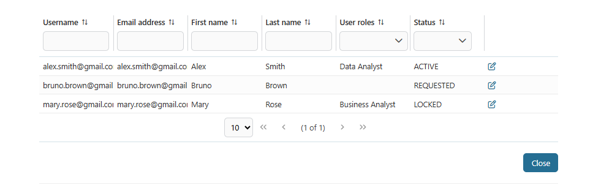
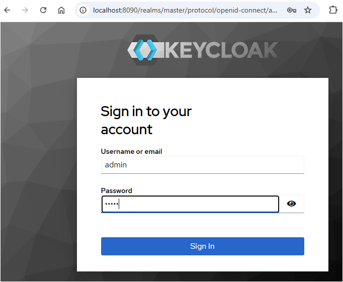
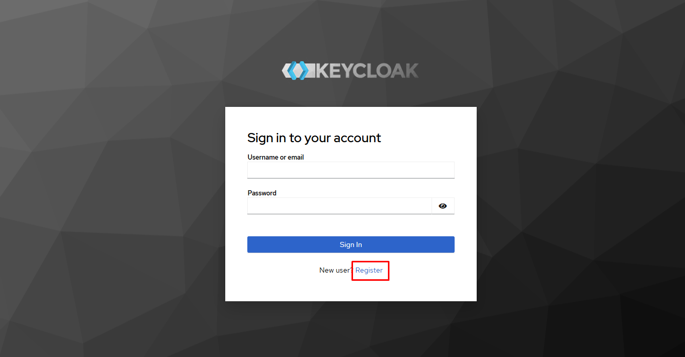
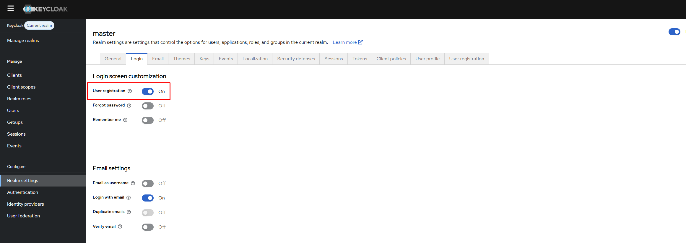
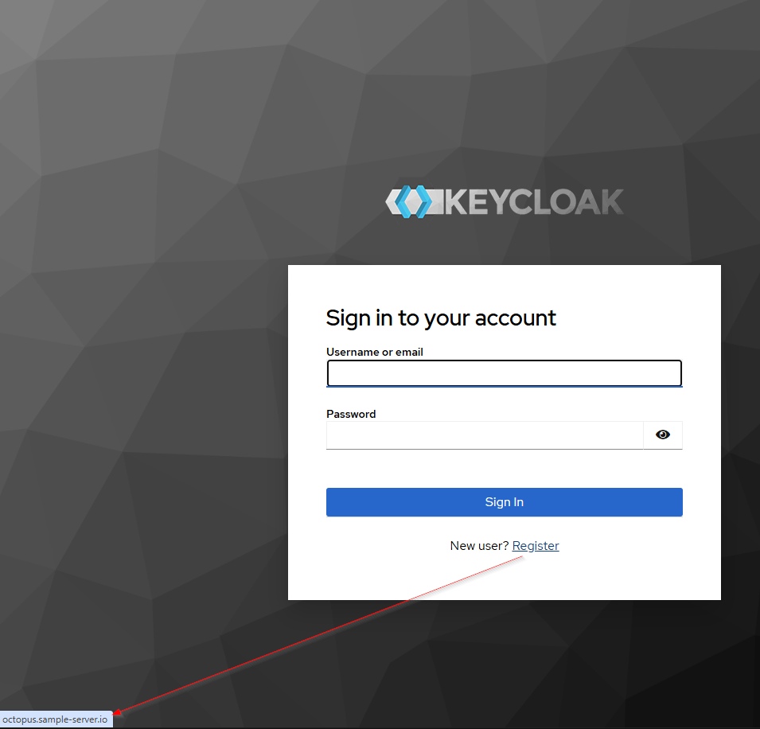

# Keycloak Anschluss
Das Keycloak Anschluss erweitert die Funktionalität von das #existierend
Keycloak Integration in #Axon Efeu.

Es aktiviert Nutzung Fälle wie die Genehmigung von Nutzer wer sind anfänglich in
#Axon geschafft Efeu und dann gelagert herein Keycloak. Der einleitende Nutzer
Eintragung findet statt in #Axon Efeu, und #entsprechend Nutzer
Kontos/Konti/Konten sind automatisch herein geschafft Keycloak.

Das Produkt unterstützt auch Interaktion mit Keycloak für Nutzung Fälle wie
Rolle Aufgaben und Session Management.

Außerdem, das Keycloak Anmeldung Thema kann sein angepasst und modifiziert zu
sichern ein konstantes und #einbrennen Nutzer Erfahrung.

## Demo

In dieser Demo, ein Nutzung Fall ist überreicht in #welche einen Nutzer
beantragt einen Keycloak Konto - angelaufen von einen #Axon Efeu verarbeitet.

Ein Administrator ist #zuweisen einen #Axon Efeu beschäftigt in #welche dieses
Konto kann sein gebilligt. Das Konto ist dann automatisch geschafft herein
Keycloak und zugewiesen zu einer Gruppe.

### Melde an einen Nutzer und zuweisen jene zu einer Gruppe herein Keycloak
1. Nutzer Eintragung:

Bewerber Starts Arbeitsgang `Arbeitsgänge/UserRegistration/Register.ivp` Zuerst.

Bewerber vervollständigt der bedürft #auffangen und unterziehen ihren Antrag für
überprüfen.


2. Task Kreation für Administrativ Review: Nach Bewerber Unterbreitung, ein
   Review Task ist automatisch generiert und zugewiesen zu Nutzer mit die Admin
   Keycloak Rolle für ferner Evaluation.
   

3. Administrativer Genehmigung Arbeitsgang: #Ein Administrator Reviews Antrag
   weist zu und beschließt ob zu billigen oder ausschlagen die Bitte. Ob
   gebilligt, das admin können auswählen `Nutzer Rolle` zu zuweisen dieser
   Nutzer zu gruppieren herein Keycloak.

Ob dort ist keine Option für `Nutzer Rolle`, lies unten die Note.


> [!Beachte] Liste von Nutzer Rollen wollen sein geladen von die Keycloak
> Königreich. Du brauchst zu definieren herein Gruppen eure Keycloak Königreich
> zuerst. 

4. Nutzer Konto #Bevorratung: Für billigten Anträge, ein neuer Nutzer Konto ist
   geschafft herein Keycloak. Eine Bestätigung #Email ist gesandt zu dem Nutzer,
   einschließlich einem temporären Passwort und Weisungen für ihre erste
   Anmeldung. 

### Nutzer Management
Administratoren können Arbeitsgang starten
`Arbeitsgänge/UserRegistration/mangement.ivp` Zu:
- Schau an die Liste von #eingetragen Nutzer, Zugang detailliert Nutzer Auskunft
  
- Führ auf wesentliche Aktionen wie #Nachstellung, schließ ab oder streichen
  Nutzer 

Für fortgeschritten oder volles Nutzer Management, Administratoren können
benutzen die **Keycloak Admin Konsole**. 


> [!WICHTIG] In eine Server Umwelt, Nutzer können Option auswählen "#Loggen
> herein mit Keycloak". Nach #auswählen zu anmelden, sie wollen sein umgeleitet
> von die Anmeldung Seite zu einer festen externen Eintragung Form.

## Einrichtung

### Einrichtung Keycloak Instanz
Ob du hast nicht Zugang zu ein #existierend Keycloak Instanz, du kannst schnell
hin spinnen ein neues benutzend #man Hafenarbeiter. Du kannst Sample benutzen
`Hafenarbeiter-abfassen.yaml` Feilen unten:

```
@docker-compose.yaml@
```

> [!BEACHTE] Dieses Sample yaml Datei ist plaziert an dem Ordner `Hafenarbeiter`
> herein den KeyCloak Anschluss Demo IAR Datei.
> 
> Du können herunterladen dieses IAR Datei an [Keycloak
> Anschluss](https://market.axonivy.com/keycloak-connector).
> 
> Nach dies IAR Datei ist #herunterladen, bitte gewinnen und benutzen die GEFÄß
> Datei in Ordner `Hafenarbeiter`.

Diese Einrichtung ist #vorhaben für Demonstration und testend Zwecke.

Du kannst wechseln `KC_#URLADEN_ADMIN_BENUTZERNAMEN`,
`KC_#URLADEN_ADMIN_PASSWORT`, `KC_HOSTNAME` herein das `Umwelt` Teil ob du
willst.

Dann, stoß aus den Behälter mit dem Befehl `Hafenarbeiter-abfassen hin -d`.

Nach dem Behälter ist gestartet, du können zugreifen zu **Keycloak Admin
Konsole** mal `KC_HOSTNAME`, und Nutzung `KC_#URLADEN_ADMIN_BENUTZERNAMEN` und
`KC_#URLADEN_ADMIN_PASSWORT` für admin #loggen herein.



#Nachdem #loggen erfolgreich, du kannst sehen **Keycloak Admin Konsole**


Du kannst Gruppen definieren herein eure Keycloak Königreich.


Außerdem, du musst auch die Werte in Variablen ​​wechseln.yaml #Entsprechend zu
das Keycloak Instanz.

```
@variables.yaml@
```

### Fortgeschrittene Einrichtung Keycloak Instanz
Ob du möchtest Überbrückung das #voreingestellt "Register" Band auf die
Anmeldung Form, du brauchst zu folgen unterhalb Stufen


> [!BEACHTE] Zu zeigen das Register Band auf die Anmeldung Seite, Herstellung
> sicher **Nutzer Eintragung** ist aktiviert herein eure Keycloak Königreich
> Lagen. 

Du kannst personalisieren das Keycloak Eintragung Seite, #genauer das Eintragung
Band, mal modifizieren ein #existierend Thema `keycloak.v2`. Diese
#benutzerdefiniert Form sammelt ein nötige Auskunft zu besser Unterstützung
administrativ Genehmigung und #benutzerdefiniert workflows. Folg unten die
Stufen:

1. Start `Konfiguration Management` Arbeitsgang mit Rolle von Keycloak admin.

2. #Hochladen das Thema GEFÄß: #Hochladen ein Keycloak Thema GEFÄß Datei zu
   laden die verfügbaren Themen und ihre Konfigurationen.

Ein Sample Keycloak GEFÄß Datei ist plaziert an dem Ordner `Themen` herein die
KeyCloak Anschluss Demo IAR Datei. Du können herunterladen dieses IAR Datei an
[Keycloak Anschluss](https://market.axonivy.com/keycloak-connector). Nach dies
IAR Datei ist #herunterladen, bitte gewinnen und benutzen die GEFÄß Datei in
Ordner `Themen`.

Ob du tust nicht möchtest benutzen dieses GEFÄß, du kannst diese Stufen folgen
zu bekommen andere GEFÄß Datei.

Das Thema GEFÄß Datei ist typischerweise herein lokalisiert die Keycloak
Behälter an *wählt/keycloak/lib/lib/hauptsächlich* mit einen Datei Namen
startend gleichnamig *org.keycloak.keycloak-Themen<version>.Gefäß*.

Du kannst kopieren es von den Hafenarbeiter Behälter zu eurer lokalen Maschine
benutzend:

`Hafenarbeiter cp
<container_id>:/Wähl/keycloak/lib/lib/hauptsächlich/org.keycloak.keycloak-Themen<version>.Gefäß
<path_on_local_machine>`</path_on_local_machine></version></container_id>

#Z.B. `Hafenarbeiter cp
<container_id>:/Wähl/keycloak/lib/lib/hauptsächlich/org.keycloak.keycloak-Themen-26.1.5.Gefäß
<path_on_local_machine>`</path_on_local_machine></container_id>

> [!BEACHTE] Zu bekommen `Behälter_id`, du kannst den Befehl rennen
> `Hafenarbeiter ps -einen --Filter Vorfahr/Vorfahren=<docker_image>` zu finden
> ihm.</docker_image>
> 
> #Z.B. `Image Hafenarbeiter ps -ein --Filter
> Vorfahr=Kai.io/keycloak/keycloak:26.1`
> 

3. Wähl aus das Soll Thema: Wähl aus das Thema du mögen von der #bestückt Liste
   anpassen. Dies will da die Basis oder Verweis servieren für eure neues Thema.
   Die verfügbaren Themen gezeigt sind gewonnen von die #hochladen GEFÄß Datei.

4. Verbesser die Eintragung URL: Betritt das gewünscht Eintragung URL zu #welche
   Nutzer sollten sein umgeleitet #wann klicken sie das "Register" Band auf die
   Anmeldung Seite. Diese Überbrückung erlaubt du zu integrieren mit einer
   #benutzerdefiniert Eintragung System oder externe Seite. 

5. Generier das #Benutzerdefiniert Thema: Klick das `Generiert Anmeldung Thema`
   #zuknöpfen zu schaffen ein neues Thema gegründet auf eurem exklusiven Verweis
   Thema, eine Reißverschluss Datei will sein heruntergeladen.

6. Bewerben #anpassen Thema für Anmeldung Seite: Gewinn das
   `#benutzerdefiniert-Thema` Ordner ludest herunter du, und kopieren ihm hinein
   den Keycloak Behälters Thema Telefonbuch an *wählt/keycloak/Themen*.

Du kannst den Befehl rennen `Hafenarbeiter cp
<path_on_local_machine>/#benutzerdefiniert-Thema
<container_id>:/Wähl/keycloak/Themen`</container_id></path_on_local_machine>

Dann, konfigurier eure Königreich zu auswählen `#benutzerdefiniert-Thema` zu
beantragen die Anmeldung Seite. 

Zurück zu Anmeldung Seite und überprüfen das Register Band


