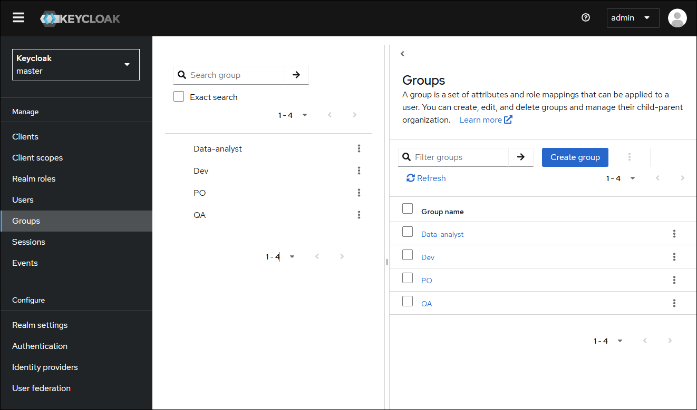
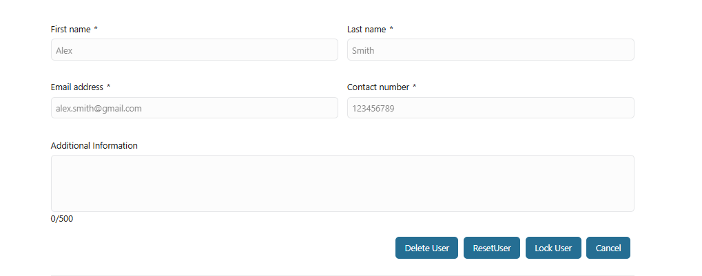
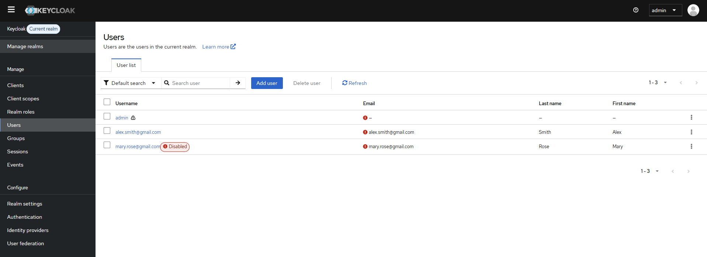
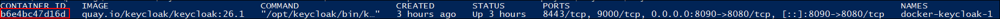

# Keycloak-Konnektor
Der Keycloak Connector erweitert die Funktionalität der bestehenden
Keycloak-Integration in Axon Ivy.

Dies ermöglicht Anwendungsfälle wie die Genehmigung von Benutzern, die zunächst
in Axon Ivy angelegt und dann in Keycloak gespeichert werden. Die erstmalige
Benutzerregistrierung erfolgt in Axon Ivy, und entsprechende Benutzerkonten
werden automatisch in Keycloak angelegt.

Das Produkt unterstützt auch die Interaktion mit Keycloak für Anwendungsfälle
wie Rollenzuweisungen und Sitzungsverwaltung.

Darüber hinaus kann das Keycloak-Anmeldethema angepasst und geändert werden, um
eine einheitliche und markengerechte Benutzererfahrung zu gewährleisten.

## Demo

In dieser Demo wird ein Anwendungsfall vorgestellt, in dem ein Benutzer ein
Keycloak-Konto beantragt – initiiert durch einen Axon Ivy-Prozess.

Einem Administrator wird eine Axon Ivy-Aufgabe zugewiesen, in der dieses Konto
genehmigt werden kann. Das Konto wird dann automatisch in Keycloak erstellt und
einer Gruppe zugewiesen.

### Registrieren Sie einen Benutzer und weisen Sie ihn einer Gruppe in Keycloak zu.
1. Benutzerregistrierung:

Der Bewerber startet zunächst den Prozess
`Processes/UserRegistration/register.ivp`.

Der Bewerber füllt die erforderlichen Felder aus und reicht seine Bewerbung zur
Prüfung ein.


2. Aufgabenerstellung für die administrative Überprüfung: Nach der Einreichung
   durch den Antragsteller wird automatisch eine Überprüfungsaufgabe generiert
   und Benutzern mit der Admin-Keycloak-Rolle zur weiteren Bewertung zugewiesen.
   

3. Administrativer Genehmigungsprozess: Ein Administrator überprüft die
   Anmeldedaten und entscheidet, ob die Anfrage genehmigt oder abgelehnt wird.
   Bei Genehmigung kann der Administrator die Benutzerrolle „ `“ (Benutzer mit
   eingeschränkter Berechtigung)` auswählen, um diesen Benutzer einer Gruppe in
   Keycloak zuzuweisen.

Wenn es keine Option für die Benutzerrolle „ `“` gibt, lesen Sie bitte den
folgenden Hinweis.


> [!Hinweis] Die Liste der Benutzerrollen wird aus dem Keycloak-Realm geladen.
> Sie müssen zunächst Gruppen in Ihrem Keycloak-Realm definieren.
> 

4. Benutzerkontoeinrichtung: Für genehmigte Anträge wird ein neues Benutzerkonto
   in Keycloak erstellt. Der Benutzer erhält eine Bestätigungs-E-Mail mit einem
   temporären Passwort und Anweisungen für die erste Anmeldung.
   

### Benutzerverwaltung
Administratoren können den Prozess `Processes/UserRegistration/mangement.ivp`
starten, um:
- Zeigen Sie die Liste der registrierten Benutzer an und greifen Sie auf
  detaillierte Benutzerinformationen zu! [manage-user](images/manage-user.png)
- Führen Sie wichtige Aktionen wie Zurücksetzen, Sperren oder Löschen von
  Benutzern durch 

Für erweiterte oder vollständige Benutzerverwaltung können Administratoren die
Keycloak-Verwaltungskonsole **** verwenden.



> [!WICHTIG] In einer Serverumgebung können Benutzer die Option „Mit Keycloak
> anmelden” wählen. Nach der Auswahl der Registrierung werden sie von der
> Anmeldeseite zu einem sicheren externen Registrierungsformular weitergeleitet.

## Einrichtung

### Einrichten der Keycloak-Instanz
`Wenn Sie keinen Zugriff auf eine bestehende Keycloak-Instanz haben, können Sie
mit Docker schnell eine neue erstellen. Sie können die folgende Beispiel-Datei
„docker-compose.yaml”` verwenden:

```
@docker-compose.yaml@
```

> [!HINWEIS] Diese Beispiel-YAML-Datei befindet sich im Ordner „ `” unter
> „docker` ” in der KeyCloak Connector Demo IAR-Datei.
> 
> Sie können diese IAR-Datei unter [Keycloak
> Connector](https://market.axonivy.com/keycloak-connector) herunterladen.
> 
> Nachdem diese IAR-Datei heruntergeladen wurde, extrahieren Sie bitte die
> JAR-Datei im Ordner „ `” und verwenden Sie sie in Docker`.

Diese Konfiguration dient zu Demonstrations- und Testzwecken.

Sie können `KC_BOOTSTRAP_ADMIN_USERNAME`, `KC_BOOTSTRAP_ADMIN_PASSWORD`,
`KC_HOSTNAME` in der Umgebung `` ändern, wenn Sie möchten.

Starten Sie dann den Container mit dem Befehl „ `docker-compose up -d` “.

Nachdem der Container gestartet wurde, können Sie auf **Keycloak Admin Console**
über `KC_HOSTNAME` zugreifen und `KC_BOOTSTRAP_ADMIN_USERNAME` sowie
`KC_BOOTSTRAP_ADMIN_PASSWORD` für die Admin-Anmeldung verwenden.


Nach erfolgreicher Anmeldung sehen Sie „ **“ (Erfolgreiche Anmeldung) in der
Keycloak-Admin-Konsole**

Sie können Gruppen in Ihrem Keycloak-Realm definieren.


Zusätzlich müssen Sie auch die Werte in variables.yaml entsprechend der
Keycloak-Instanz ändern.

```
@variables.yaml@
```

### Erweiterte Einrichtung Keycloak-Instanz
Wenn Sie den Standardlink „Registrieren” im Anmeldeformular überschreiben
möchten, müssen Sie die folgenden Schritte ausführen!
[config-registration-URL](images/config-registration-url.png)

> [!HINWEIS] Um den Link „Registrieren” auf der Anmeldeseite anzuzeigen, stellen
> Sie sicher, dass „ **” (Benutzerregistrierung)** in Ihren
> Keycloak-Realm-Einstellungen aktiviert ist.
> 

Sie können die Keycloak-Registrierungsseite, insbesondere den
Registrierungslink, personalisieren, indem Sie ein vorhandenes Theme
`keycloak.v2` ändern. Dieses benutzerdefinierte Formular erfasst die
erforderlichen Informationen, um die administrative Genehmigung und
benutzerdefinierte Workflows besser zu unterstützen. Befolgen Sie die folgenden
Schritte:

1. Starten Sie den Prozess „ `-Konfigurationsmanagement“` mit der Rolle
   „Keycloak-Administrator“.

2. Laden Sie die Theme-JAR-Datei hoch: Laden Sie eine Keycloak-Theme-JAR-Datei
   hoch, um die verfügbaren Themes und deren Konfigurationen zu laden.

Eine Beispiel-JAR-Datei für Keycloak befindet sich im Ordner „ `themes` ” in der
IAR-Datei „KeyCloak Connector Demo”. Sie können diese IAR-Datei unter [Keycloak
Connector](https://market.axonivy.com/keycloak-connector) herunterladen. Nachdem
Sie diese IAR-Datei heruntergeladen haben, extrahieren Sie bitte die JAR-Datei
im Ordner „ `themes` ” und verwenden Sie sie.

Wenn Sie diese JAR-Datei nicht verwenden möchten, können Sie die folgenden
Schritte ausführen, um eine andere JAR-Datei zu erhalten.

Die Theme-JAR-Datei befindet sich in der Regel im Keycloak-Container unter
*opt/keycloak/lib/lib/main* mit einem Dateinamen, der wie folgt beginnt:
*org.keycloak.keycloak-themes<version>.jar*.

Sie können sie mit folgendem Befehl aus dem Docker-Container auf Ihren lokalen
Rechner kopieren:

`docker cp
<container_id>:/opt/keycloak/lib/lib/main/org.keycloak.keycloak-themes<version>.jar
<path_on_local_machine>`</path_on_local_machine></version></container_id>

Beispiel: `docker cp
<container_id>:/opt/keycloak/lib/lib/main/org.keycloak.keycloak-themes-26.1.5.jar
<path_on_local_machine>`</path_on_local_machine></container_id>

> [!HINWEIS] Um die Container-ID `container_id` zu erhalten, können Sie den
> Befehl `docker ps -a --filter ancestor=<docker_image>` ausführen, um sie zu
> finden.</docker_image>
> 
> Beispiel: `image docker ps -a --filter
> ancestor=quay.io/keycloak/keycloak:26.1`

3. Wählen Sie das Ziel-Theme aus: Wählen Sie aus der geladenen Liste das Theme
   aus, das Sie anpassen möchten. Dieses dient als Grundlage oder Referenz für
   Ihr neues Theme. Die angezeigten verfügbaren Themes werden aus der
   hochgeladenen JAR-Datei extrahiert.

4. Aktualisieren Sie die Registrierungs-URL: Geben Sie die gewünschte
   Registrierungs-URL ein, zu der Benutzer weitergeleitet werden sollen, wenn
   sie auf den Link „Registrieren” auf der Anmeldeseite klicken. Diese
   Überschreibung ermöglicht Ihnen die Integration mit einem benutzerdefinierten
   Registrierungssystem oder einer externen Seite.
   

5. Erstellen Sie das benutzerdefinierte Theme: Klicken Sie auf die Schaltfläche
   „ `“ (Benutzerdefiniertes Theme erstellen) und dann auf „Login Theme` “
   (Login-Theme erstellen), um ein neues Theme basierend auf dem von Ihnen
   ausgewählten Referenz-Theme zu erstellen. Eine ZIP-Datei wird
   heruntergeladen.

6. Wenden Sie ein benutzerdefiniertes Design für die Anmeldeseite an: Entpacken
   Sie den heruntergeladenen Ordner „ `custom-theme` ” und kopieren Sie ihn in
   das Designverzeichnis des Keycloak-Containers unter „ *opt/keycloak/themes*
   ”.

Sie können den Befehl „ `“ ausführen. docker cp /custom-theme
:/opt/keycloak/themes`

Konfigurieren Sie dann Ihren Bereich so, dass „ `” ausgewählt wird.
custom-theme`, um es für die Anmeldeseite zu verwenden.


Zurück zur Anmeldeseite und den Registrierungslink überprüfen


